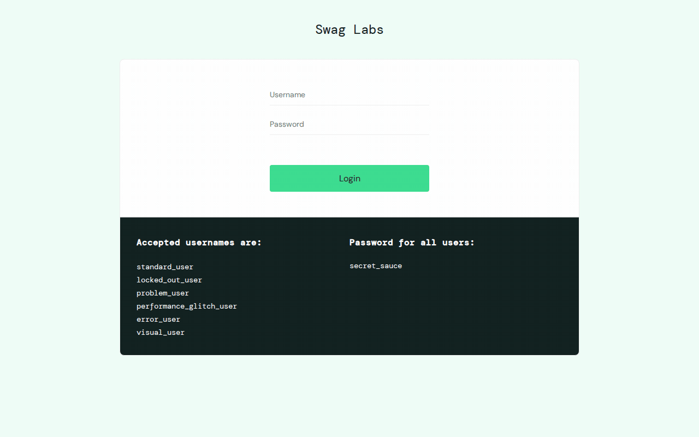
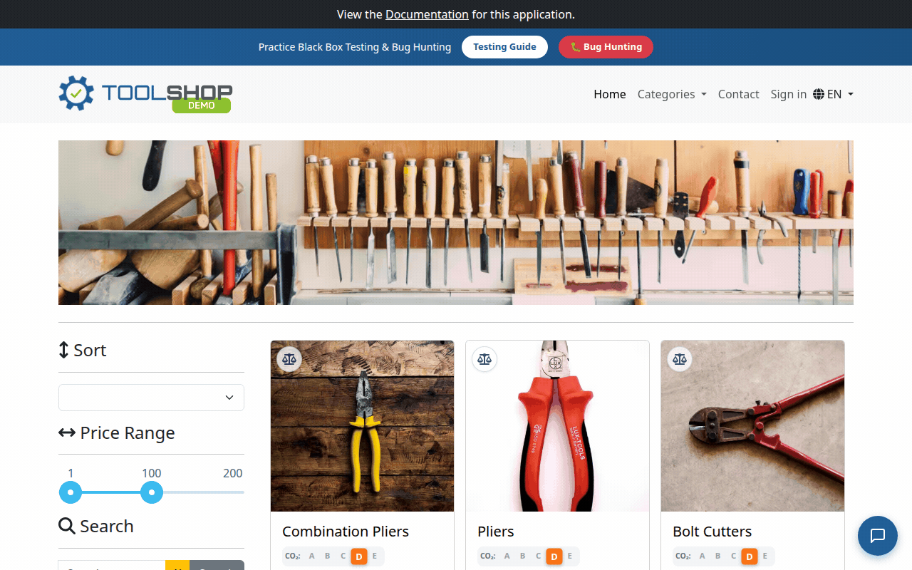

# Cueframe

Cueframe records a browser workflow into a JSON demo spec, adds callouts anchored to real
page elements, and exports the result as a self-contained HTML reel, an MP4, or a GIF.

> Status: experimental alpha (v0.1). Works best on apps with stable selectors. Built in one
> autonomous Claude Code `/goal` run; [GOAL.md](GOAL.md) is the original build brief.



You point it at a running web app and tell it, in plain English, what workflow to record. It
drives the app and captures a reel of frames. Then you shape the demo by talking: "call out
the results around the middle," "make that pause longer," "drop the last one." Cueframe
resolves the exact frame, the anchor, and the copy for you. When the reel looks right, it
exports.

The point is callouts tied to DOM elements instead of hand-placed video labels, and a demo you
can re-generate from a description instead of re-recording from scratch.

---

## The three acts

Cueframe is a pipeline of three acts over one artifact, [`spec.json`](#the-specjson-contract).

1. **Capture (the Showrunner).** Drive a running app with browser automation and record a
   workflow into a `spec.json` whose `frames[]` describe what happened. Each frame carries a
   real caption, a searchable accessibility digest, and measured element boxes.
2. **Author (callouts).** Edit the `callouts[]` by talking. You describe *what* to point at
   and *roughly where*; Cueframe resolves the exact frame, anchor, and copy. You never count
   frames or write JSON.
3. **Play and export.** A framework-light web player renders the reel: frames advance,
   callouts appear anchored to their elements, dwell, then leave. Exporters turn that into a
   self-contained HTML file, an MP4, and a GIF.

---

## Install (from source)

Cueframe is not published to npm yet, so install it from a clone. It ships two ways from one
codebase.

### As a CLI (the engine)

```
git clone https://github.com/iamneilroberts/cueframe
cd cueframe
npm install
npx playwright install chromium
npm run build
```

After `npm run build`, run the CLI from inside the repo with `npx cueframe <verb>` (npm
resolves the local package bin). To get a global `cueframe` command, run `npm link`. The verbs:

```
npx cueframe capture <url> [--out spec.json] [--scenario steps.json] [--viewport 1280x800]
npx cueframe play <spec.json> [--port 5180] [--open]
npx cueframe export <spec.json> --format html|mp4|gif [--out demo.html]
npx cueframe validate <spec.json>
```

Exporting MP4 or GIF needs [`ffmpeg`](https://ffmpeg.org/) on your `PATH`.

### As a Claude Code plugin (the conversational acts)

The `plugin/` directory is an installable Claude Code plugin with two skills and two slash
commands:

- **cueframe-capture** (`/cueframe-capture`), the Showrunner. "Record adding a todo and
  completing it."
- **cueframe-callouts** (`/cueframe-callout`), callout authoring. "Add a callout for the
  results board around frame 6, make it pause longer."

Point your plugin config at this repo's `plugin/` directory (it holds
`.claude-plugin/plugin.json`). The skills call the same core libraries the CLI does.

---

## Quickstart: reproduce the golden example

From a clean clone, one command captures the bundled sample app, authors three callouts,
exports all three formats, and verifies every acceptance check:

```
npm install
npx playwright install chromium
npm run build
npm run acceptance
```

`npm run acceptance` writes the full golden example to `examples/golden/` (`spec.json`,
`frames/`, `demo.html`, `demo.mp4`, `demo.gif`) and prints a PASS or FAIL line for each check
in [the Definition of Done](GOAL.md#6-definition-of-done-the-stop-gate). It edits no JSON by hand and is deterministic per machine: consecutive runs produce identical
artifacts. Note it regenerates the committed `examples/golden/` files in place, so `git status`
may show them modified afterward if your platform renders fonts differently than the committed
snapshot. The callouts are authored from plain-English instructions through
the same `src/callout` engine the conversational skill drives.

Open `examples/golden/demo.html` in any browser to watch the reel.

### The same, step by step

```
# 1. Serve the sample app (terminal A)
npm run sample                       # http://localhost:5173

# 2. Capture a spec (terminal B)
npx cueframe capture http://localhost:5173 --out demo/spec.json
npx cueframe validate demo/spec.json # zero schema errors, zero capture defects

# 3. Author callouts. Talk to the cueframe-callouts skill in Claude Code, e.g.
#    "add a callout for the add button while the first todo is being typed"
#    "point a callout at the active filter near the end, title it 'Filter to focus'"

# 4. Export
npx cueframe export demo/spec.json --format html --out demo/demo.html
npx cueframe export demo/spec.json --format mp4  --out demo/demo.mp4
npx cueframe export demo/spec.json --format gif  --out demo/demo.gif
```

See [`docs/walkthrough.md`](docs/walkthrough.md) for an annotated tour of the golden example.

---

## Examples

Three worked examples ship in [`examples/`](examples/), each captured end to end. The bundled
todo app (`examples/golden/`) is deterministic and runs in CI. The other two capture live
third-party sites, with callouts auto-anchored to each site's own elements.

- **SauceDemo, a checkout funnel** (`npm run example:saucedemo`) is the reel at the top of
  this page.
- **Toolshop, browse to cart** (`npm run example:toolshop`):



Per-example walkthroughs (frames, callouts, and the anchors they resolved to) plus a "use it on
your own app" scenario are in [`examples/README.md`](examples/README.md).

---

## The `spec.json` contract

`spec.json` is the single source of truth that flows through all three acts. It is defined
once in [`src/spec/`](src/spec/) (TypeScript types plus a runtime validator) and validated
everywhere.

```jsonc
{
  "meta": { "title", "app", "createdAt", "viewport": { "w", "h" }, "voice"? },
  "frames": [
    {
      "id": "f6", "n": 6, "kind": "golden" | "raw", "img": "frames/f6.png",
      "caption": "what happened on this frame",
      "axDigest": "searchable DOM/AX summary",
      "boxes": [ { "selector": "[data-board]", "rect": { "x","y","w","h" }, "label"? } ],
      "action"?: { "label", "selector" }
    }
  ],
  "callouts": [
    { "id": "c1", "frame": "f6", "anchor"?: { "selector"? | "rect"? },
      "eyebrow"?, "title", "body"?, "dwellMs"?, "style"?: "card" | "spotlight" | "arrow" }
  ]
}
```

Callout resolution depends on three fields per frame: `caption`, `axDigest`, and `boxes`.
`cueframe validate` checks that every *golden* frame has a non-empty caption, a non-empty
axDigest, and at least one real box (a selector and a pixel rect), and reports any that don't
as **capture defects**, kept separate from schema errors. The point is to fail loudly on a
thin capture rather than silently degrade the callout step, which has nothing to resolve
against without these fields.

### Voice is configurable

Callout copy defaults to plain sentences, no em-dashes, written like a person labeling a
screen. That default lives in `meta.voice` (`style: "plain"`, `allowEmDash: false`), and the
callout skill reads `meta.voice` instead of hardcoding the rule, so a team can set its own
house voice. When `meta.voice` is absent, the plain default applies.

---

## Why Playwright for capture?

The capture engine uses [Playwright](https://playwright.dev/) (Chromium). It is scriptable
without Claude Code, so `npx cueframe capture` runs in CI and from a plain shell. It is
deterministic and headless. And it exposes the two APIs the capture-quality contract depends
on: `boundingBox()` for pixel-accurate `boxes`, and DOM and accessibility introspection for
the `axDigest`. The conversational Showrunner skill can also
use the chrome-devtools MCP for interactive discovery, but the engine itself stays on
Playwright so any capture reproduces outside a Claude Code session.

---

## Layout

```
src/spec/      Canonical spec.json types + runtime validator (the contract)
src/capture/   Showrunner: Playwright-driven capture into spec.json (rich frames)
src/callout/   Callout edit library: NL frame/anchor/copy resolution + immutable edits
src/player/    Framework-light web player (timeline + self-contained runtime)
src/export/    Exporters: self-contained HTML, MP4, GIF
src/cli.ts     The cueframe CLI (capture / play / export / validate)
src/acceptance.ts  Acceptance gate + golden-example generator (npm run acceptance)
src/examples.ts    Builder for the live-site showcase examples (npm run example:*)
examples/todo-app/  The bundled sample capture target (npm run sample)
examples/golden/    The deterministic golden example (npm run acceptance)
examples/saucedemo/ Live checkout-flow showcase (npm run example:saucedemo)
examples/toolshop/  Live browse-to-cart showcase (npm run example:toolshop)
plugin/        Claude Code plugin: capture + callout skills, slash commands
```

Run `npm test` (unit and browser tests), `npm run typecheck`, and `npm run acceptance` (the
end-to-end gate). See [`CONTRIBUTING.md`](CONTRIBUTING.md).

## Limitations

- Capture needs Chromium via Playwright. MP4 and GIF export need `ffmpeg` on your `PATH`.
- It works best on apps with stable selectors (`#id`, `[data-*]`, ARIA roles). Brittle markup
  produces weaker anchors.
- You describe the workflow; Cueframe does not discover a meaningful demo on its own. A bare
  URL with no scenario falls back to a thin auto-explore.
- Nondeterministic UIs (randomized or AI-generated content) capture, but the spec will not
  reproduce identically run to run.
- It is not a general video editor. One workflow per spec; no branching or live re-capture.

## Security and privacy

Captured screenshots are real pixels from the app you point it at, so they can contain
whatever was on screen, including sensitive data. The HTML export inlines those frames as
base64, so the file carries the images with it. Review a spec and its exports before sharing
them, the same way you would review a screen recording.

## Roadmap

Near-term, no grand claims:

- Publish to npm so `npx cueframe` works without a clone.
- A second bundled (non-third-party) example beyond the todo app.
- `spotlight` and `arrow` callout styles polished to match `card`.
- Optional per-element selector hints in a scenario, for apps without stable attributes.

## License

MIT. See [`LICENSE`](LICENSE).
